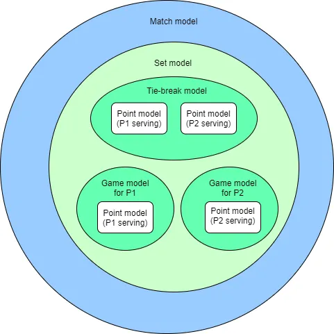
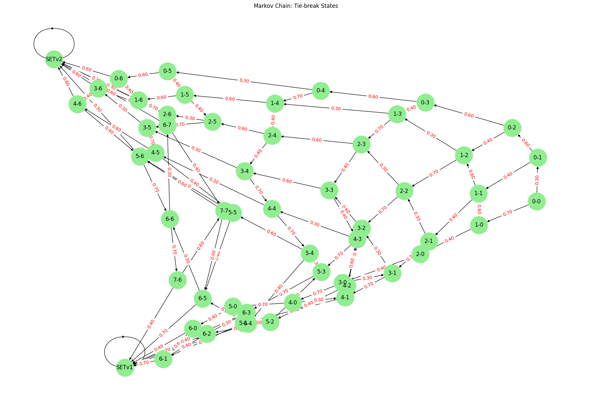

Can we characterize a Tennis match as a Hidden Markov Model?

This repo helps modelize a tennis match with the help of markov chains. \
Because of the particular structure of tennis matches, i.e. imbricated sequential models which 
are perfectly described with Hierarchical Hidden Markov Models (HHMM), we only need two inputs - the probabilities of each player winning a point.\
Given our only two inputs - the probabilities of each player winning a point on his serve we can modelize a game and a tie-break first, then we can use these modelizations to modelize a set, and finally we can use the set model to modelize a whole match.

